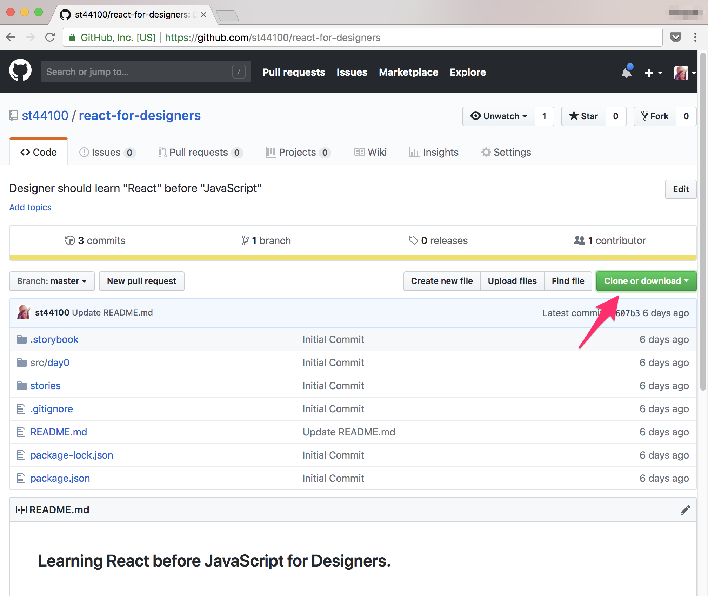
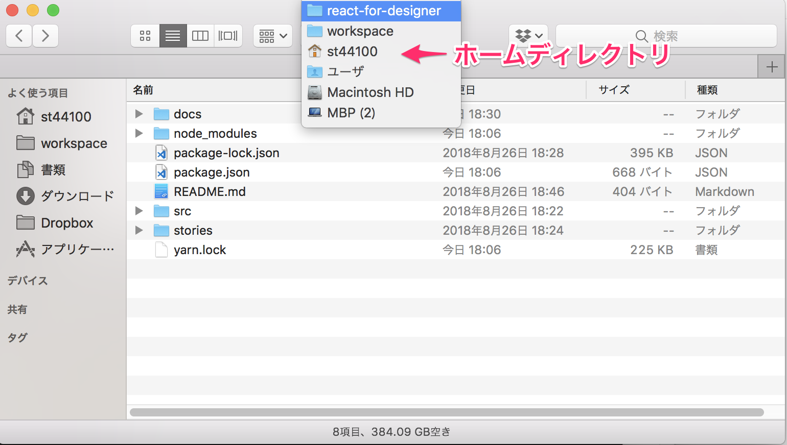
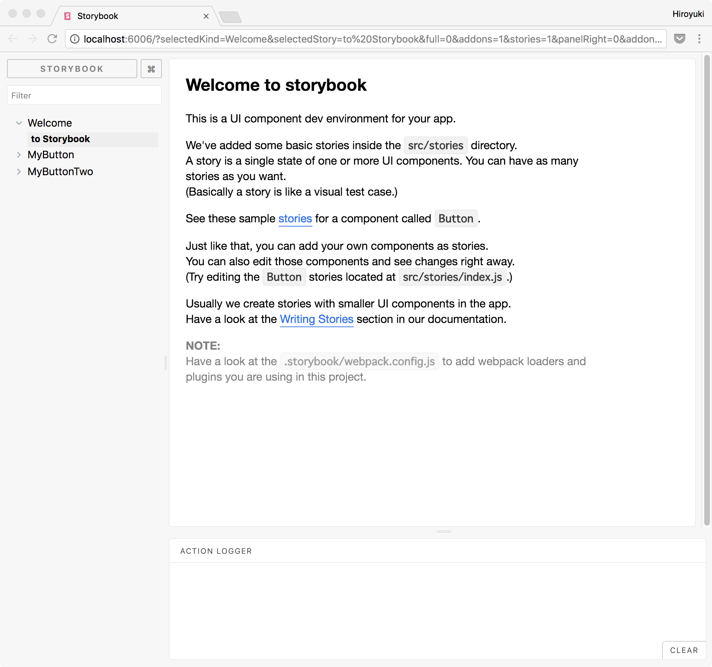

# アジェンダ

- セットアップ
- とりあえずReactを書いて、動かす
- Sketchからコードへ
- 次回予告

## 注意

この講座ではフロントエンドを養成するためのレクチャーではありません。
あくまでデザイナーがデザイナーの１ツールとしてReactを使って、デザインできることを目的としています。

今回のことで、「もう俺、React完全理解したわ」と思ったら大間違いです。
フロントエンドは、フロントエンドのツールとしてReactを使って、Webフロントエンドを開発しています。
「デザイナーのためのReact」では、デザイナーがデザインを作るためのツールとしてReactを使えるようになるのが目標です。
その後フロントエンドに興味をもって、フロントに転身するのもアリです。

#  セットアップ

## Node.jsのインストール

https://nodejs.org/ja/


## Visual Studio Code(VSCode)sのインストール

https://code.visualstudio.com/


## 動作確認

VSCode上でターミナルを開きます。VSCodeを開いて、以下のショートカットを実行するとターミナルが開きます。

```
Control + `
```
注) 「`」はシングルクウォートじゃなくて、バックチック

ターミナルが開いたら、以下のコマンドを実行します。


```sh
node --version
```

nodeが正しくインストールされていれば、何かしらの数字が帰ってくるはずです。
さらに以下のコマンドを実行字
```sh
npm --version
```

何かしらの数字が帰ってこればOKです。

ここでは`node`と`npm`は、名前だけ覚えておいて貰えば大丈夫です。

## 教材のダウンロード

githubに公開しているので、そこからダウンロードします。

https://github.com/st44100/react-for-designers



githubになれている人は、`git clone`してもOK。
好きなところに、展開してください。

Tipsとして、自分のホームディレクトリからあまり深い位置に置かない方がいいです。
ターミナルになれてないうちは、ディレクトリの移動に時間がかかるのため、なるべくHomeからすぐ行けるところに置いておくとストレスがないと思います。




## プロジェクトに必要なライブラリのダウンロード

ダウンロードした教材のディレクトリをVSCodeで開きましょう。

メニューから ファイル > 開く (⌘ + o) で表示された、ファイルダイアログで、先ほど展開したディレクトリを開きます。

VSCodeでディレクトリが開けたら、VSCodeのターミナルを開きます(Control + `)

ターミナルで、以下のコマンドを実行します。

```
npm install
```

すると何やら色々ダウンロードしだすので、完了するまで待ちましょう。


# とりあえず動かしてみる

必要なライブラリがダウンロードできたら、準備完了です。
ReactやJavaScript何もしらなくていいので、とりあえず動かしてみましょう。

以下のコマンドを実行します。

```
npm start
```

:point_down: 実行結果の例
```
$ npm start

> react-for-designers@1.0.0 start /Users/st44100/workspace/react-for-designer
> start-storybook -p 6006

info @storybook/react v3.4.10
info
info => Loading custom addons config.
info => Using default webpack setup based on "Create React App".
webpack built 782b81bfe416a1a3e1a6 in 5037ms
info Storybook started on => http://localhost:6006/
info

```
するとさっきみたいな何やら色々動いて、最終的に1つのURLが出てきます。
出てきたURLを⌘キーを押しながらクリックしてみましょう。ブラウザが立ち上がって、そのURLが表示されるはずです。



さっそくWelcomeページを書き換えましょう。JSなんて知らなくていいです。
とりあえず、見よう見まねでやりましょう。

VSCodeでWelcome.jsxを開きます。Welcom.jsxは`src`ディレクトリ下の`day0`の中にあります。
こういう場合、エンジニアはよく`./src/day0/Welcome.jsx`と表記します。
`./`は、今いる場所という意味。

Welcome.jsxを開いたら、適当にテキストを書き換えてみましょう。

書き換えて保存するとターミナルで何やらガチャガチャ動き出すと思います。
一旦無視して、ブライザに戻ってみましょう。
先ほどのWelcomeページがリロードしていないのに書き換わっているはずです。

ここまできたらもうとりあえずReactは書けて、自分の書いたコードが動いていることになります。

自分が知っているHTML/CSSの知識を総動員して、一度できる限りWelcomeページを改変していってみましょう。

==ここら辺で休憩==

# デザインをつける

## スタイリングについて

Reactのスタイリング手法はいくつかあります。
今回は`styled-components`というものを使います。

大体以下のような形でCSSを記述して、スタイリングします。

:point_down: styled-componentsによるReactのスタイリングの例。

```jsx
const FancyDiv = styled.div`
  margin: 8px;
  padding: 4px;
  boarder-radius: 4px;
  border: solid 1px #999;
`;
```

適当なスタイルをSketchからコピーすることで、SketchのデザインをReactへ反映できます。


:point_down: Sketchの「Copy CSS attributes」した結果の例。
```css
/* My Fansy Heading: */
font-family: HiraginoSans-W7;
font-size: 18px;
color: #F5A623;
letter-spacing: 0;
text-align: center;
```

適当にスケッチ上で見出しのテキストスタイルを作って、コピーしてReactへ反映してみましょう。

## ここからはエクストラ

時間が余ったら以下を座学的に紹介

- nodeとnpm
- JavaScriptとReact
- Framer X ちらみせ

## 次回予告


**次回予告 ReactでUIデザインできるようになってみよう**


## コラム Node.js と npm, JavaScriptとReact

Node.jsはJavaScriptの実行環境です。
JavaScriptの実行環境で一番普及しているのは、Webブラウザです。
JavaScriptはだけでは、パソコン上では実行する事ができないのです。
これは全てのプログラミング言語にいえることで、人間が読めるテキストをコンピュータは直接実行できないんです。
実行するためには、コンパイルしてコンピュータがわかるかたちに変換したり、実行環境をつくってその上で動かすしかないのです。
JavaScriptのようなスクリプト言語は大体実行環境の上で実行します。

JavaScriptとReactの関係。
よくReactはビューのライブラリと言われます。確かにそれは間違ってないのですが、Reactではビュー以外のこともReactのやり方で表現できます。
またReactはJSXと呼ばれる形式でプログラミングしていきます。
JSXはJavaScriptのスーパーセットで、JavaScriptにReact独自の機能を足したものになります。

ちなみにProcessingはJavaのスーパーセットです。

npmはパッケージ管理ツールです。Sketchでいう`sketchpack`みたいなものです。
プログラムの実行に必要なライブラリやツール群を管理してくれています。


